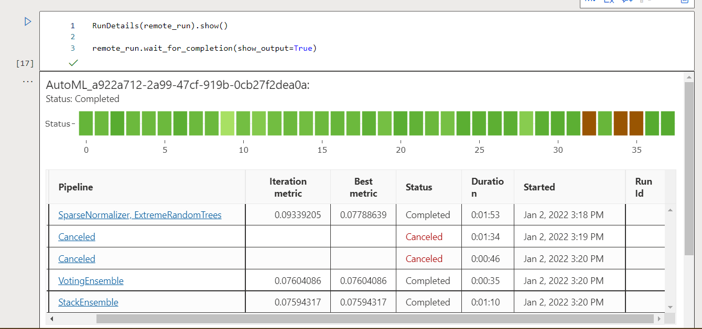
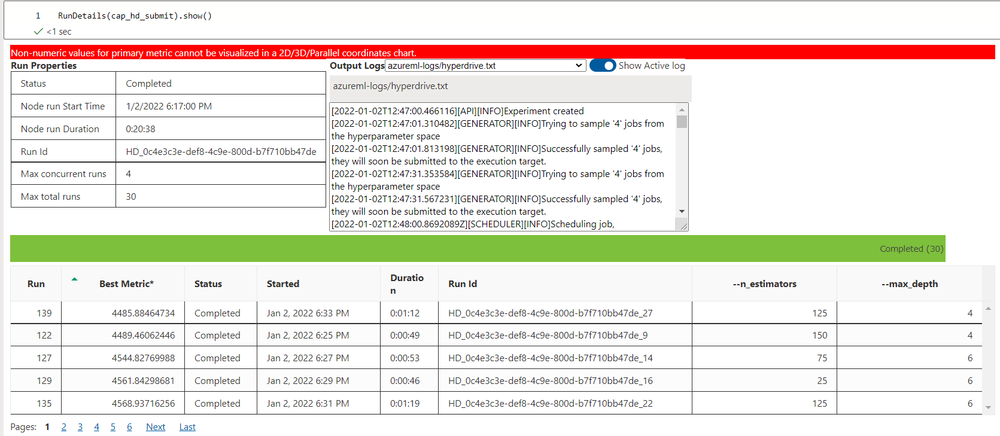
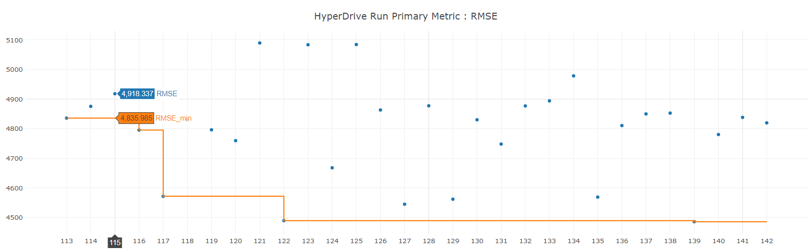
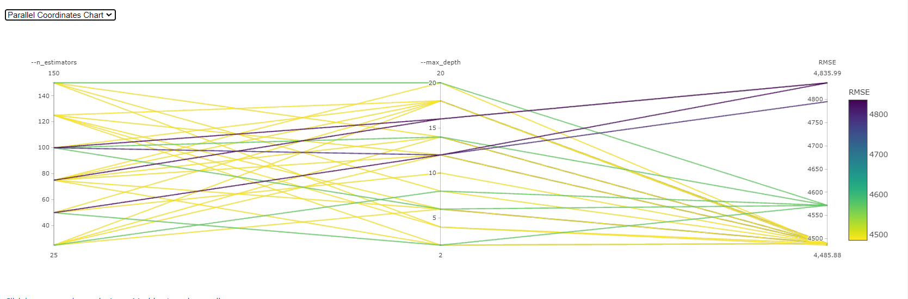
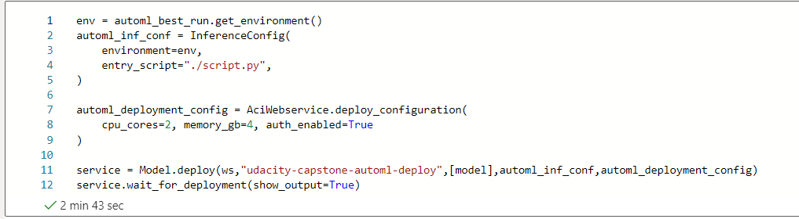
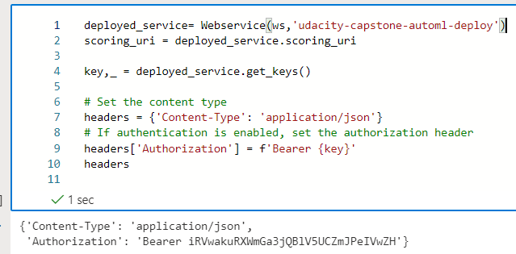
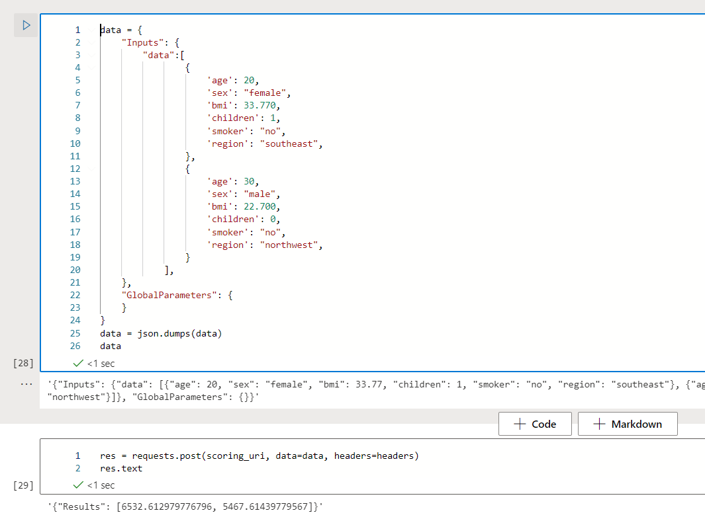
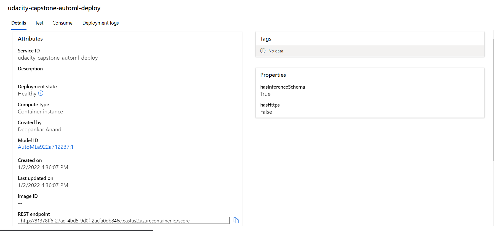

# Capstone Project: Medical Insurance Premium Prediction

In this project we predict medical insurance premium for different individuals. We develop an AutoML regression model and a RandomForestRegressor model and tune its parameter using hyperdrive. We have also deployed the automl model on the internet and tested it using http requests.

## Project Set Up and Installation
We complete the entire project in ML Studio on Azure. 
I have created the code in Notebook interface in Azure. I've used AzureML SDK with python to provision clusters, execute experiments, analyse best models, deploy the best models, and access those endpoints using REST Api calls.

## Dataset

### Overview
I
I've used open source data from [kaggle]('https://www.kaggle.com/tejashvi14/medical-insurance-premium-prediction').  
The data contains information of 1339 individuals living in the United States of America. Based on the features we have come up with a model to predict medical insurance premium price.  

### Task
There are 7 columns, 6 features and one target column i.e., *charges*.
Here is the list of features  

|S.no|Feature|Description|
|----|-------|-----------|
|1|age|Age of each individual|
|2|sex|Gender of each individual|
|3|bmi|Body Mass Index (BMI) of each individual|
|4|children|Total number of children each person have|
|5|smoker|Whether the person is a smoker or not (True or False)|
|6|region|What part of the country each individual belong to|

The data does not contain missing values.
While feature engineering we convert the categorical features, which are sex, smoker and region to numerical features. 

### Access
For automl experiment I've uploaded the dataset and registered it as Azure Datastore, which stores the dataset in Tabular format. Later I using AzureML SDK to pull this data in jupyter notebook and use it to create the model.
For Hyperparameter tuning experiment, I've uploaded the data in github and accessed it directly in the `script.py` python script. Later on I've used Azure notebooks to tune hyperparameters for the Random Forest Algorithm.

## Automated ML
I've used the following AutoML settings:
1. `n_cross_validations`: the number of cross validation each time model is trained.
2. `primary_metric`: the decision metric, based on the type of task, which the automl model will optimize. I've used normalized root mean squared error for our regression problem.
3. `experiment_timeout_hours`: the maximum amount of time before the experiment terminates.
4. `max_concurrent_iterations`: the maximum number of iterations allowed to run in parallel.
5. `task`: kind of ml task we want to run. Choices: (classification,regression,forecasting). I've set it as regression as I'm preditcting charges which is a floating value.
6. `compute_target`: compute target which is used to run the AutoML experiment.
7. `training_data`: dataset on which we want to run AutoML experiment.
8.  `label_column_name`: the target column in the provided dataset.

### Results
StackEnsemble is the best model from our AutoML experiment.  
  
The insurance value in our data ranges from *$1,135.94* to *$60,021.4* i.e., a range of *$58,885.5*. The best normalized root mean squared value our model obtain is 0.07594, which mean only 7.59% deviation from the actual values. 
We can further improve the performance by including more records in our dataset as well as including more features such as medical history, type of profession, marital status etc.


```
StackEnsembleRegressor(
    base_learners=[('1', Pipeline(
        memory=None,
        steps=[('maxabsscaler', MaxAbsScaler(
            copy=True
        )), ('xgboostregressor', XGBoostRegressor(
            random_state=0,
            n_jobs=1,
            problem_info=ProblemInfo(
                gpu_training_param_dict={'processing_unit_type': 'cpu'}
            ),
            tree_method='auto'
        ))],
        verbose=False
    )), ('30', Pipeline(
        memory=None,
        steps=[('standardscalerwrapper', StandardScalerWrapper(
            copy=True,
            with_mean=False,
            with_std=False
        )), ('xgboostregressor', XGBoostRegressor(
            random_state=0,
            n_jobs=1,
            problem_info=ProblemInfo(
                gpu_training_param_dict={'processing_unit_type': 'cpu'}
            ),
            booster='gbtree',
            colsample_bytree=0.9,
            eta=0.5,
            gamma=0.01,
            max_depth=8,
            max_leaves=0,
            n_estimators=50,
            objective='reg:linear',
            reg_alpha=1.3541666666666667,
            reg_lambda=1.6666666666666667,
            subsample=1,
            tree_method='auto'
        ))],
        verbose=False
    )), ('20', Pipeline(
        memory=None,
        steps=[('standardscalerwrapper', StandardScalerWrapper(
            copy=True,
            with_mean=False,
            with_std=True
        )), ('extratreesregressor', ExtraTreesRegressor(
            bootstrap=False,
            ccp_alpha=0.0,
            criterion='mse',
            max_depth=None,
            max_features=0.8,
            max_leaf_nodes=None,
            max_samples=None,
            min_impurity_decrease=0.0,
            min_impurity_split=None,
            min_samples_leaf=0.003466237459044996,
            min_samples_split=0.026024633095283807,
            min_weight_fraction_leaf=0.0,
            n_estimators=10,
            n_jobs=1,
            oob_score=False,
            random_state=None,
            verbose=0,
            warm_start=False
        ))],
        verbose=False
    )), ('24', Pipeline(
        memory=None,
        steps=[('standardscalerwrapper', StandardScalerWrapper(
            copy=True,
            with_mean=False,
            with_std=True
        )), ('lightgbmregressor', LightGBMRegressor(
            boosting_type='gbdt',
            colsample_bytree=0.6,
            learning_rate=0.16842263157894738,
            max_bin=1023,
            max_depth=9,
            min_data_in_leaf=0.0032263930780845784,
            min_split_gain=0.7368421052631579,
            n_estimators=100,
            num_leaves=255,
            reg_alpha=0,
            reg_lambda=0.75,
            subsample=0.9,
            subsample_freq=6,
            random_state=None,
            n_jobs=1,
            problem_info=ProblemInfo(
                gpu_training_param_dict={'processing_unit_type': 'cpu'}
            )
        ))],
        verbose=False
    )), ('29', Pipeline(
        memory=None,
        steps=[('maxabsscaler', MaxAbsScaler(
            copy=True
        )), ('randomforestregressor', RandomForestRegressor(
            bootstrap=True,
            ccp_alpha=0.0,
            criterion='mse',
            max_depth=None,
            max_features=0.3,
            max_leaf_nodes=None,
            max_samples=None,
            min_impurity_decrease=0.0,
            min_impurity_split=None,
            min_samples_leaf=0.003466237459044996,
            min_samples_split=0.000630957344480193,
            min_weight_fraction_leaf=0.0,
            n_estimators=100,
            n_jobs=1,
            oob_score=False,
            random_state=None,
            verbose=0,
            warm_start=False
        ))],
        verbose=False
    )), ('25', Pipeline(
        memory=None,
        steps=[('sparsenormalizer', Normalizer(
            copy=True,
            norm='max'
        )), ('xgboostregressor', XGBoostRegressor(
            random_state=0,
            n_jobs=1,
            problem_info=ProblemInfo(
                gpu_training_param_dict={'processing_unit_type': 'cpu'}
            ),
            booster='gbtree',
            colsample_bytree=0.9,
            eta=0.3,
            gamma=0.01,
            grow_policy='lossguide',
            max_bin=1023,
            max_depth=6,
            max_leaves=7,
            n_estimators=400,
            objective='reg:linear',
            reg_alpha=1.4583333333333335,
            reg_lambda=2.3958333333333335,
            subsample=0.6,
            tree_method='hist'
        ))],
        verbose=False
    )), ('5', Pipeline(
        memory=None,
        steps=[('maxabsscaler', MaxAbsScaler(
            copy=True
        )), ('elasticnet', ElasticNet(
            alpha=0.001,
            copy_X=True,
            fit_intercept=True,
            l1_ratio=1,
            max_iter=1000,
            normalize=False,
            positive=False,
            precompute=False,
            random_state=None,
            selection='cyclic',
            tol=0.0001,
            warm_start=False
        ))],
        verbose=False
    ))],
    meta_learner=ElasticNetCV(
        alphas=None,
        copy_X=True,
        cv=None,
        eps=0.001,
        fit_intercept=True,
        l1_ratio=0.5,
        max_iter=1000,
        n_alphas=100,
        n_jobs=None,
        normalize=False,
        positive=False,
        precompute='auto',
        random_state=None,
        selection='cyclic',
        tol=0.0001,
        verbose=0
    ),
    training_cv_folds=5
)

```

## Hyperparameter Tuning
In this experiment we've created a Random Forest regressor model because it can handle the unbalanced data easily, also it does not overfit and can handle very large number of features and records.

For tuning hyperparamters I picked two parameters, `n_estimators` and `max_depth`. `n_estimators` control the number of trees in our model and `max_depth` determines the maximum depth of each tree in the forest.

|Parameter|Range|
|---------|-----|
|`n_estimators`|`[25,50,75,100,125,150]`|
|`max_depth`|`[(4,6,8,10,12,14,16,18,20)]`|


### Results
*TODO*: What are the results you got with your model? What were the parameters of the model? How could you have improved it?
After hyperparameter tuning the best values I got for `n_estimators` and `max-depth` are 125 and 4. And the minimum RMSE and NRMSE I got after using the values for the best parameters are 4485.885 and 0.076 respectfully. 





In the above run details screenshot one can see that the best score is 4481.8459 and the run is executed successfully.

To further improve the model performance we can undertake the following improvements  
1. Increase the size of parameter search space.
2. Test with different early stopping policies
3. Create the model with more robust algorithms like XGBoost or ANN.


## Model Deployment
Since bothe the models have similar performance i.e., the normalized RMSE values are 0.076. I decided to deploy the AutoML model. I used AzureML SDK to create Inference Configuration and Deployment Configuration and deploy the model using `Model` class



For quering the endpoint, first access the keys and scoring uri using the deployed service via `scoring uri` attribute and `get_keys` method. Next create a sample data in JSON format and pass these three as parameters in `requests.post` method of the `requests` module in Python. 



Using the `.text` attribute found in the properties of our result, we can see the list containing our prediction.


### Active Endpoint

This is the screenshot of the deployed endpoint. 
## Screen Recording
[Youtube Video](https://youtu.be/SFcxCr4zqzU)
