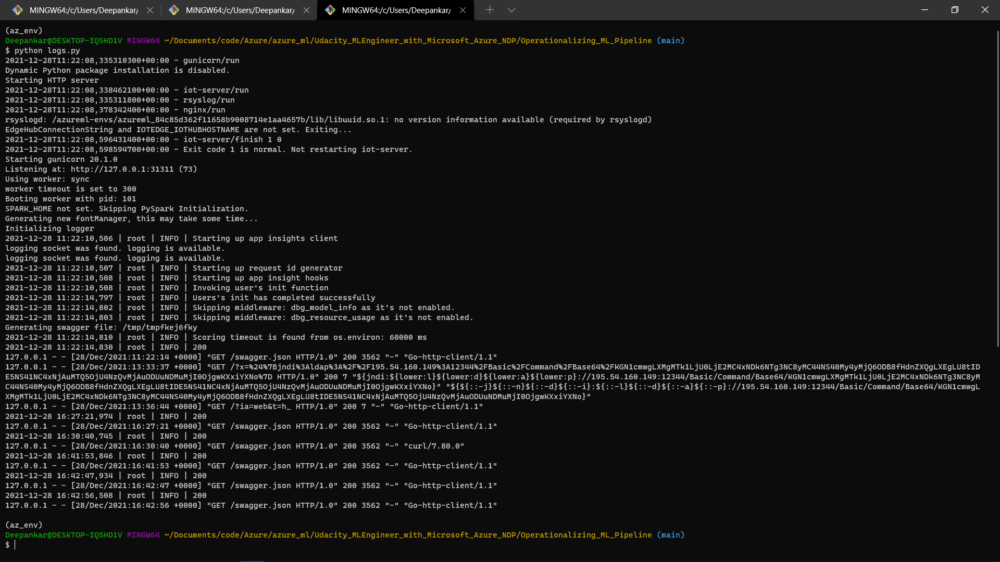
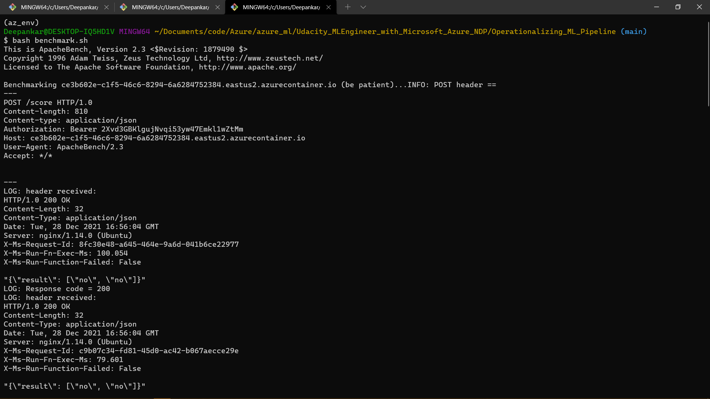

*NOTE:* This file is a template that you can use to create the README for your project. The *TODO* comments below will highlight the information you should be sure to include.

# Operationalizing Machine Learning

This project is a part of Udacity Machine Learning With Azure Nanodegree. In this project we focus on deveoping ML models, deploying them on the web, and consume them using REST Api. We will also work on creating and deploying a Machine Learning pipeline.

## Architectural Diagram

## Steps
1. **Authentication**  
In this step we create a service principle and give it access to the ML Workspace in the ML Studio.
2. **Automated ML Experiment**  
We create an AutoML Experiment using our bank marketing dataset. It is a classifiacation problem and we are predicting whether the customer will subscribe to the term policy or not.
3. **Deploy the best model**  
In this step we choose the best classification model. In our case it is Voting Ensemble. We deploy this model via a REST endpoint.
4. **Enable logging**  
We enable application insights which monitor the performance of our model. 
Also we can print logs using AzureML SDK.
5. **Swagger Documentation**  
We can easily test our deployed endpoints with the help of Swagger. 
6. **Consume model endpoints**    
We then use `enpoint.py` script to make predictions using REST Api calls.
7. **Create and publish a pipeline**  
In this step we create a pipeline using AutoML step and deploy it using AzureML Studio.
8. **Documentation**  
Document the entire process in the form of README file.

## Key Steps
1. Create Service Principal 
 
Create a service principle. 
2. Assign Owner Role to the service principal for the workspace
 
Assign Owner Role to the created service principle. Give access to the ML Workspace in ML Studio.
3. Dataset

The dataset which we use is bankmarketing data. 
4. Experiment Complete

It is the screenshot depicting that our experiment is complete.
5. Best Model

In the screenshot we can see that Voting Ensemble is our best model with 94.758% accuracy. with 100% sampling and experiment took 1 minute 35 seconds to finish.
6. Enable Application Insights
  
I've enables application insights using AzureML SDk.
7. View Logs

Above image shows the logs of the experiment.
8. Swagger Runs

In this section we can see that we've started our server on port 8000 and got a response of 200. Which means success.
9. REST Api Calls using `endpoint.py` script

In this section we have executed the script to predict for two examples, and for both examples we have received "no" as response in the JSON format. 
10. Apache Benchmarking
`
This is a screenshot of Apache benchmark test on our best model.
11. Create Pipeline & Endpoint

Here we create an ML Pipeline and create an endpoint in AzureML Studio Pipeline Designer.
12. Dataset with AutoML step
  
Here we can see that our pipeline consists of two steps  
    1. Dataset Output  
    2. AutoML Step
13. Pulish Pipeline

This screenshot containts the proof of active REST endpoint.
14. Rundetails in jupyter notebook & Scheduled Run

In this screenshot we can see the details in AzureML Studio of Pipeline steps and when these were scheduled

## Screen Recording
[Demonstration: Operationalizing Machine Learning](https://www.youtube.com/watch?v=duR8zGpmswk)

## Standout Suggestions
For future projects we can devlop add a front end to our application so the common user can directly enter values on the browser and obtain the results there itself. 
We can add more features to improve performance of the data. We also try achieving this by increasing the records or by using Deep Learning methods.
